# Performance Profiling Task

## before optimization

first render

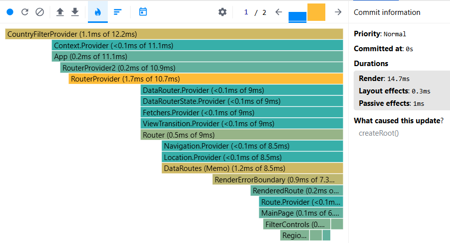
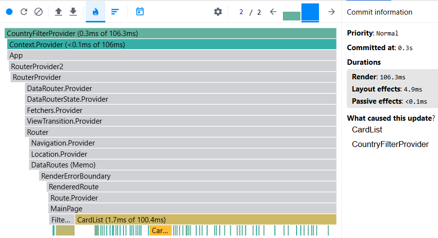
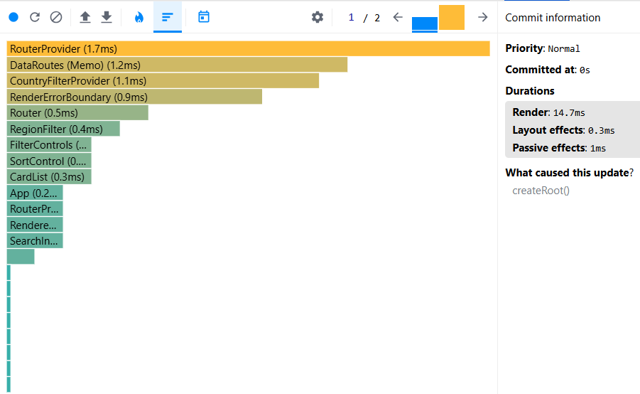
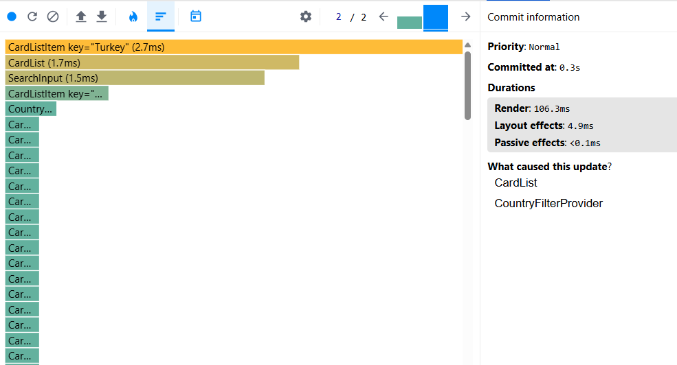

filter by region

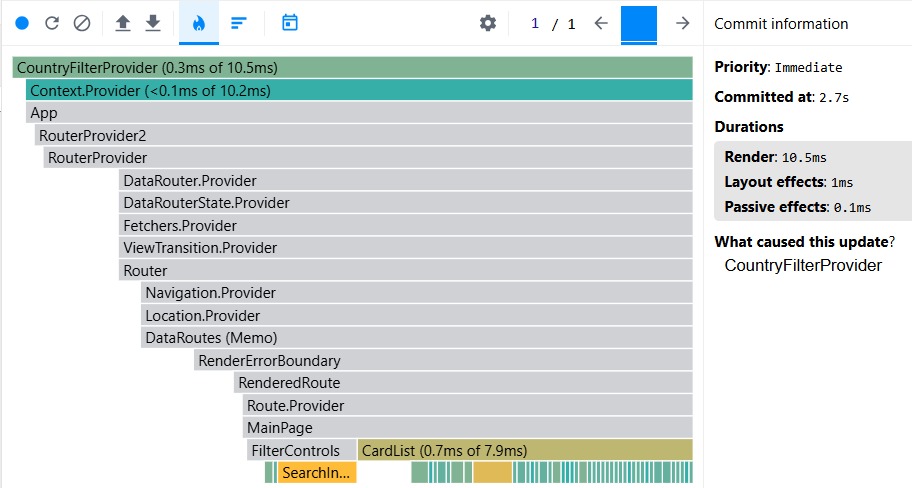
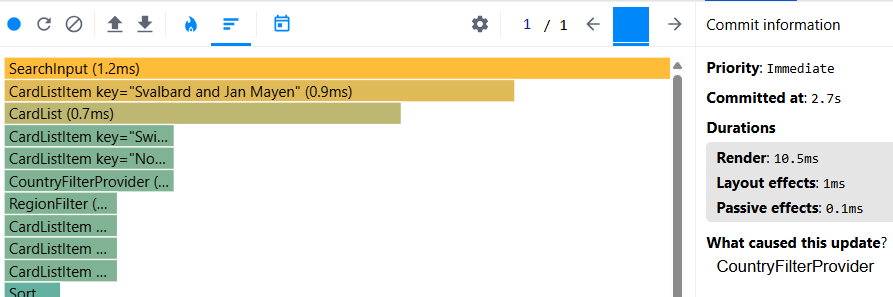

sorting by population

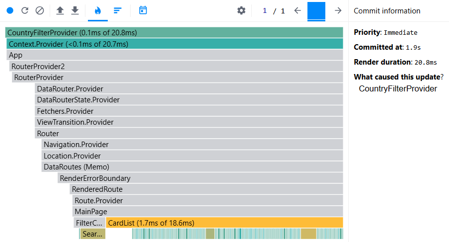
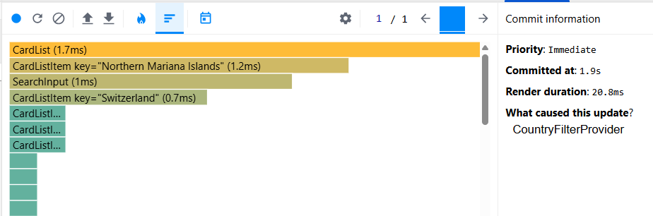

searching by name

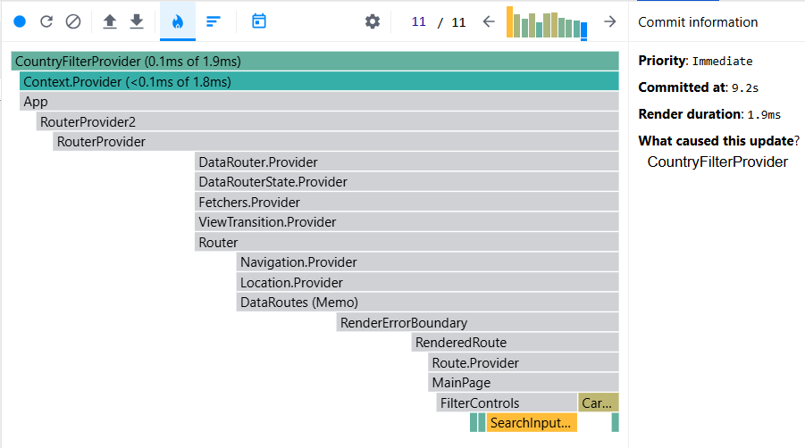
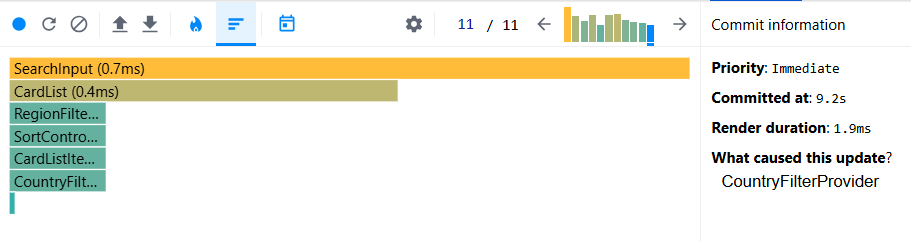

## after optimization

first render

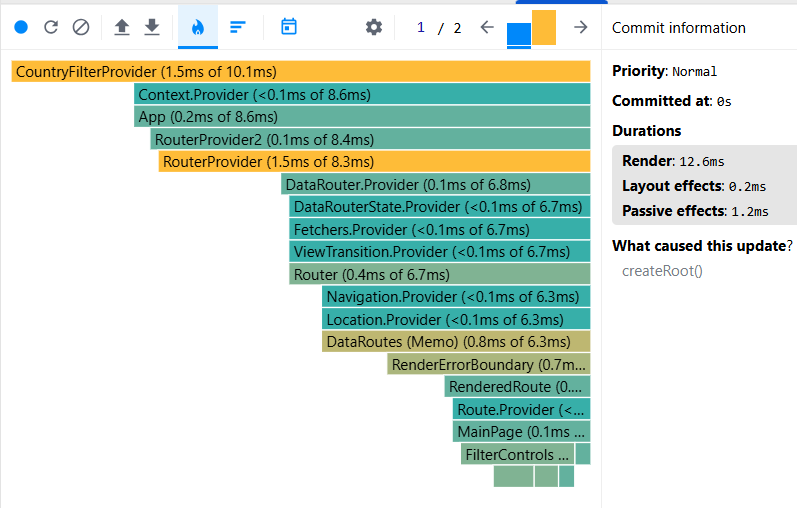
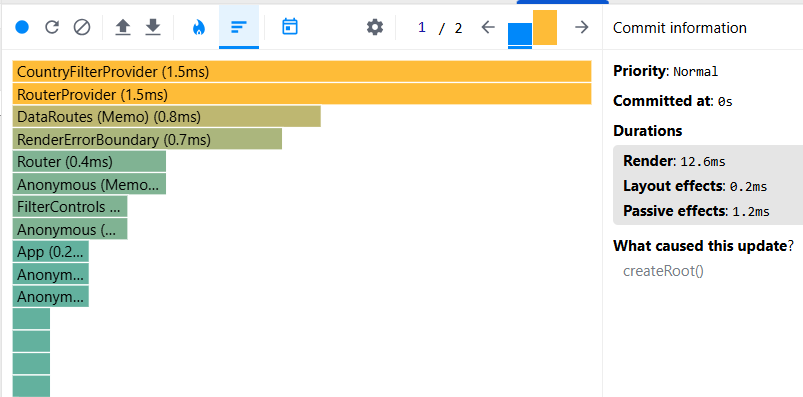
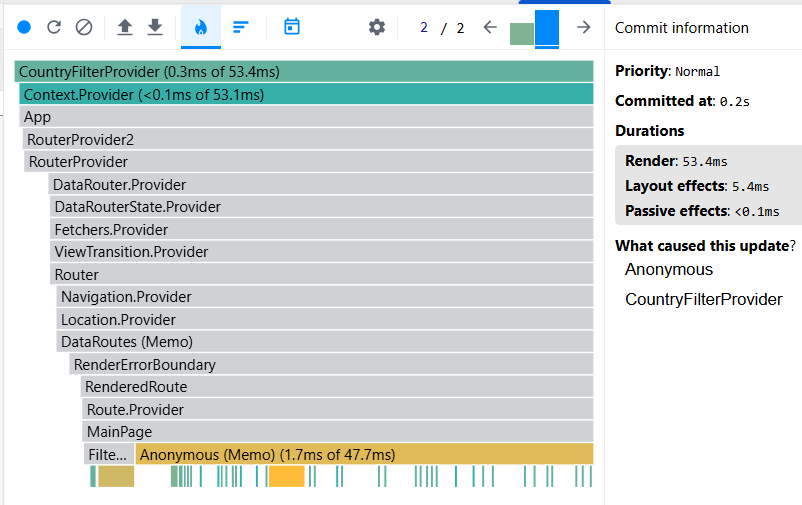
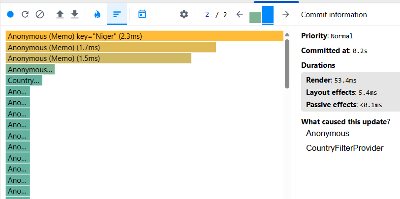

filter by region

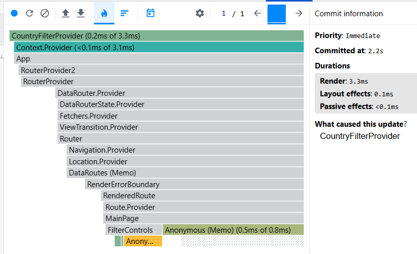
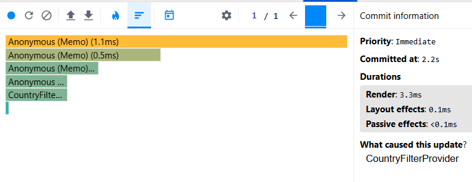

sorting by population

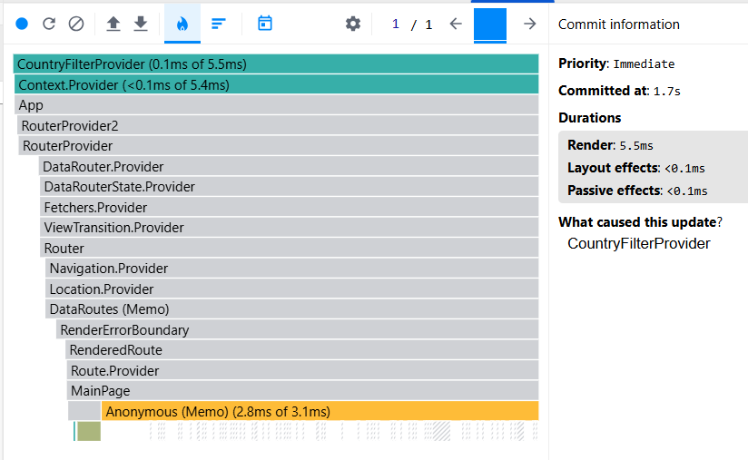
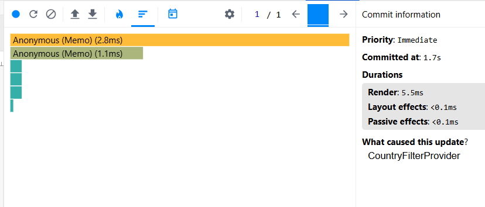

searching by name

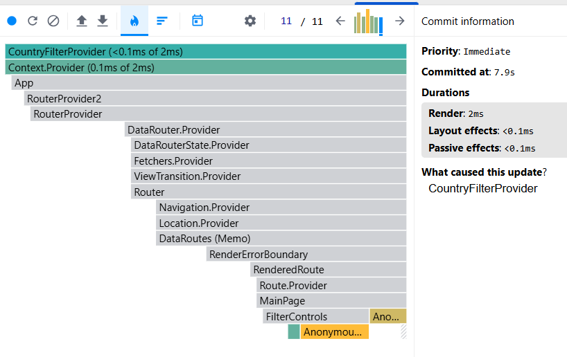
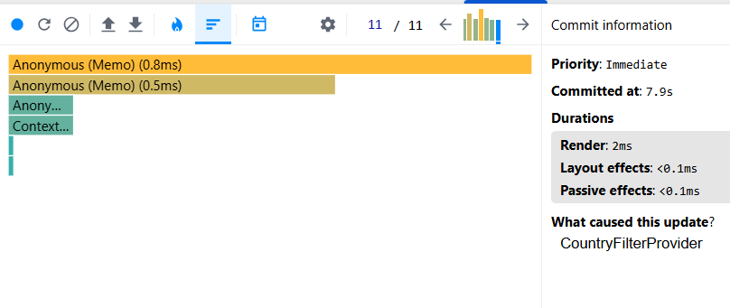

## Conclusion

| Components and actions | Before   | After   | Reduced   |
| ---------------------- | -------- | ------- | --------- |
| App render             | 14.7 ms  | 12.6 ms | 14.29 %   |
| CardList               | 106.3 ms | 53.4 ms | 49.76 %   |
| Filter by region       | 10.5 ms  | 3.3 ms  | 68.57 %   |
| sorting by population  | 20.8 ms  | 5.5 ms  | 73.56 %   |
| searching by name      | 1.9 ms   | 2 ms    | unchanged |
